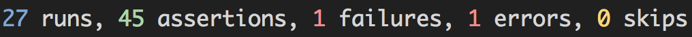

# Our first Minitest Extension

In this chapter, I will take you through the journey of building a really tiny
Minitest extension. For the purpose of this chapter, we will build a gem that
applies colors to the final test results of a Minitest suite.

This is what the our end result should look like:



At the end of this section, you will know how to build a small Minitest
extension, packed in a gem. We will also learn about writing and loading plugins
into the Minitest test run.

## Setting up the plugin skeleton

We will call this plugin `minitest-clr`, an acronym of *Minitest Color Results*.
First, open up your terminal and type:

```bash
bundle gem minitest-clr
```

This command will generate a skeleton for a gem, which will allow us to easily
work with our extension and upload it later on Rubygems.org. The command's output
will look something like:

```bash
➜  bundle gem minitest-clr
Creating gem 'minitest-clr'...
      create  minitest-clr/Gemfile
      create  minitest-clr/.gitignore
      create  minitest-clr/lib/minitest/clr.rb
      create  minitest-clr/lib/minitest/clr/version.rb
      create  minitest-clr/minitest-clr.gemspec
      create  minitest-clr/Rakefile
      create  minitest-clr/README.md
      create  minitest-clr/bin/console
      create  minitest-clr/bin/setup
      create  minitest-clr/.travis.yml
      create  minitest-clr/.rspec
      create  minitest-clr/spec/spec_helper.rb
      create  minitest-clr/spec/minitest/clr_spec.rb
Initializing git repo in /some/path/here/minitest-clr
```

Having our gem skeleton in place, let's take a step back and cover some important
rules about writing Minitest plugins (or, extensions). Minitest, on start-up,
looks for files in Ruby's `LOAD_PATH` whose names match `minitest/*_plugin.rb`.
So, by naming our gem `minitest-clr`, the actual name of the library will become
`minitest/clr`. On the code level, it means that the `Clr` class will live under
the `Minitest` namespace.

As you can notice in the skeleton output above, as expected, bundler has no idea
that we want to build a Minitest extension, therefore it's not creating a
`minitest/clr_plugin.rb` file.

## Adding the plugin

The file will be consisted of two methods, `Minitest.plugin_clr_options` and
`Minitest.plugin_clr_init`. Let's create the file on our own, and add the first
method:

```ruby
# minitest-clr/lib/minitest/clr_plugin.rb

module Minitest
  def self.plugin_clr_options(opts, options)
    opts.on "-c", "--clr", "Colorize results" do
      options[:clr] = true
    end
  end

  def self.plugin_clr_init(options)
    # To do later...
  end
end
```

There are couple of important things that you must understand about the naming
and the load order of Minitest extensions:

Note that we are adding the methods to the `Minitest` module. This is due to the
workings of Minitest's internals. By loading the `clr_plugin` on start-up it
will try to invoke the `Minitest.plugin_clr_options` method. If our plugin was
called `lorem_ipsum_plugin`, then the method it would try to invoke on start-up
would be `Minitest.plugin_lorem_ipsum_options`. The same applies to the other
method, `Minitest.plugin_clr_init`, which will cover in a bit.

Now, although Minitest is a testing tool, it is a command line tool as well.
Think about it - it allows us to run our tests from the command line. Having that
behaviour in mind, the role of the method `plugin_clr_options` is to take the
options hash and the opts, which is an object of the `OptionParser` class, and
deal with the various flags/options that this plugin might need.

To show this in action, our method will take the `-c` or `--clr` flags, which
will enable our plugin at runtime. This means that to get colored test results,
the user will have to run his tests with:

```bash
ruby -I lib:test test/a_test.rb --clr
```

Or

```bash
ruby -I lib:test test/a_test.rb -c
```

Please note that, if you are building plugins, try not to override any of the
available flags for Minitest.

## Plugin Initialization

Since our options parsing is in place, we can continue with the other method -
`Minitest.plugin_clr_init`. This is the method where our plugin will be invoked
on runtime.

Although our plugin is small, there are some things that must be understood
before we continue with the plugin.

### Terminal Colors

Without going much in depth on this topic, let's cover the basics. In our test
results, we are interested in using four colors: blue, green, red and yellow.
Each of these colors will represent different information: blue for overall test
runs, green for the number of assertions, red for railures and errors, and yellow
for skipped tests.

Colors in terminals are achieved by using special characters. To see them in
action, try this in your terminal:

```bash
echo "\e[32m green output!"
```

As you can notice, the characters `\e[32m` made the text green. Let's create a
small class, that will apply colors to any strings:

```ruby
module Minitest
  class Colorize
    ESC    = "\e[0m"

    GREEN  = "\e[32m"
    BLUE   = "\e[34m"
    RED    = "\e[91m"
    YELLOW = "\e[93m"

    def self.green(string)
      "#{ESC}#{GREEN}#{string}#{ESC}"
    end

    def self.blue(string)
      "#{ESC}#{BLUE}#{string}#{ESC}"
    end

    def self.red(string)
      "#{ESC}#{RED}#{string}#{ESC}"
    end

    def self.yellow(string)
      "#{ESC}#{YELLOW}#{string}#{ESC}"
    end
  end
end
```

The `Colorize` class has five constants, four of which represent a color, and
one that is used to represent color escaping. For example, when we want to make
a string appear in yellow color in the terminal, we can use:

```ruby
Colorize.yellow("Lorem ipsum dolor sit amet")
```

If we try this class in `irb`, we will notice something interesting:

```irb
>> Colorize.yellow("Lorem ipsum dolor sit amet.")
=> "\e[0m\e[93mLorem ipsum dolor sit amet.\e[0m"
```

The `Colorize` class will only append the proper coloring to the text, but the
magic happens when we ouput the text to `STDOUT`, using the well known `puts`
method:

```irb
>> puts Colorize.yellow("Lorem ipsum dolor sit amet.")
```

The result:


### Manipulating IO

Since we have dealt with the coloring class, let's get back to our plugin and
the `Minitest.plugin_clr_init` method.
